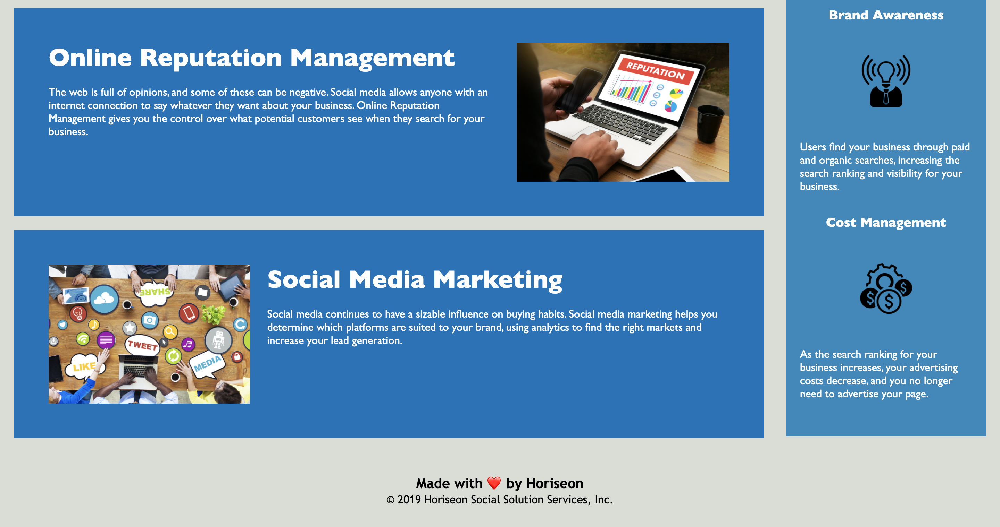

# Refactoring

## Refactoring an existing code for Horiseon website (June 13, 2021)

The goal of this project was to refactor an existing site. The finished code has improved web accessibility, semantic HTML elements, alt attributes, and comments for more concise look, sustainability, and better user experience. 

Link to deployed website:
https://alenareh.github.io/Website-refactoring/

## Demo

## Contributors

- Alena Rehberger <https://github.com/AlenaReh>